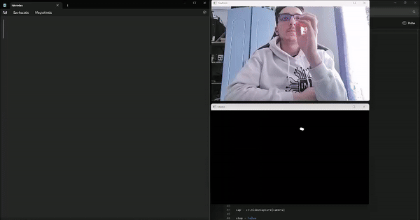

<h1>Írjunk a levegőben!</h1>
A projekt a <i>Mesterséges intelligencia</i> című tantárgyam beadandó feladataként készült. A program kamerakép alapján felismeri egy tárgy mozgását és a levegőben rajzolt betűt virtuálisan leüti.
  
A tárgyat a számítógép szín alapján érzékeli, majd egy konvolúciós neurális háló segítségével megállapítja, hogy milyen betűt rajzoltunk vele a levegőben. Az érzékeléshez használt minták a <i>letters</i> mappában találhatók, a <i>model</i> mappában pedig előre elkészített modellek vannak.

 

<h2>A program által használt modulok</h2>

- OpenCV - https://pypi.org/project/opencv-python/
- TensorFlow - https://www.tensorflow.org
- Pynput - https://pypi.org/project/pynput/
- Pillow - https://pillow.readthedocs.io/en/stable/
- Matplotlib - https://matplotlib.org/
- Imutils - https://github.com/PyImageSearch/imutils
- NumPy - https://numpy.org/